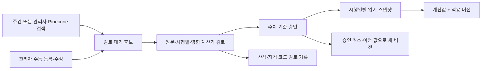

# 임금계산기 감사 및 법률 기준 갱신 종합 보고서

기준일: 2026-09-17. 대상: wage_calculator, 상담 파이프라인, 관리자 화면, 법률 데이터 운영.
사용자 정책: **자동 검색으로 후보 생성 → 관리자 검토·승인 → 시행일별 적용**.

## 1. 종합 판정

계산기의 실행 가능성과 법적 정답성은 다르다. 이전 감사에서 28개 등록 유형의 대표 호출과
기존 테스트는 통과했지만, 미개근 주휴수당 지급, 5인 미만 연차 계산, 분기 수당 월 환산,
윤년 체불이자 예외 등 계산·분기 결함이 확인되었다. 이번 작업은 법률 기준 갱신 기능을 구현한 것이며,
이러한 기존 산식/자격 오류를 모두 수정한 것은 아니다.

이번에 추가로 확인한 근본 문제는 법적 기준이 `constants.py`, 개별 계산기,
`legal_hints.py`, 파이프라인의 사실 주입 블록에 분산되어 있다는 점이다.
한 파일의 금액만 바꾸면 다른 계산기와 상담 답변은 이전 값을 계속 사용할 수 있었다.
연도 키만 있는 표로는 연중·분기 변경도 표현하기 어렵다.

현재 상태:

| 구분 | 상태 |
|---|---|
| 승인 기반 갱신 기능 | 로컬 구현 및 검증 완료 |
| 실제 Pinecone 연결 | 읽기 전용 검색 성공, 외부 데이터 변경 없음 |
| 실제 PostgreSQL 저장·동시성·권한 | 분리된 일회용 PostgreSQL 17에서 4개 테스트 통과 |
| 운영 Supabase 마이그레이션 | 미실행 |
| 정기 검색 운영 활성화 | 미실행; GitHub 변수·secrets 및 기본 브랜치 반영 필요 |
| 실제 법률 기준값 등록/승인 | 미실행; 임의 법률값을 초기 데이터로 넣지 않음 |
| 계산기 관리 모드 | 기본 꺼짐; 운영 준비 후 LEGAL_RULES_ENABLED=true |
| 기존 계산기 감사 지적사항 | 아래 미해결 목록 유지 |

## 2. 법적 근거의 신뢰 수준

법적 정보는 Pinecone `laborlaw-v2`에서만 조회한다. Pinecone은 검색 저장소이며,
검색 적중 자체가 최신 법률 또는 정확한 적용 해석을 보증하지 않는다.

이전 감사의 일부 판단에는 Pinecone에 수록된 해설서와 재수록 자료가 포함되어 있었다.
이를 모두 공식 조문 원문 검증과 동일하게 취급해서는 안 된다. 이번 구현에서는 다음을 구분한다.

1. **코드 재현 확인:** 현재 입력에 대해 실제 반환한 값·예외·분기 모순.
2. **법률 검토 단서:** Pinecone에서 찾은 조문명·문서번호·판례번호·해설.
3. **승인 가능한 근거:** 허용된 문서 종류, 공식 HTTPS 출처 메타데이터, Pinecone 원문,
   원문에 존재하는 인용구절, 관리자에 의한 값·시행일·적용범위 대조.

현재 승인 허용 문서 종류는 law/statute/regulation/interpretation/precedent이다.
공식 출처는 law.go.kr, moel.go.kr, scourt.go.kr, work24.go.kr, ei.go.kr,
nps.or.kr, nhis.or.kr, comwel.or.kr, nts.go.kr 및 각 하위 도메인으로 제한한다.
본문에 공식 주소가 적혀 있더라도 메타데이터에 출처가 없으면 승인할 수 없다.
source_type만으로 원문 진위를 확정하지 않으며 최종 내용 대조는 관리자의 책임이다.

앞선 감사에서 지목한 근기 68207-1346, 근로기준정책과-1254/-993,
퇴직연금복지과-1041, 고용노동부고시 제2025-124호, 판례 2023다302838/2021다227100은
후속 법률검토 대상 목록으로 유지한다. 이번 구현에서 이 번호를 승인 데이터로 자동 전환하지 않았다.
`2023다302579`과 '1년 평균임금이 5% 높으면 선택' 규칙은 여전히 근거 검증 보류이다.

## 3. 구현한 갱신 기능



### 자동 검색

- 28개 계산 주제를 대상으로 Pinecone 검색을 수행한다.
- 검색 문서 ID·내용 해시·주제로 중복 후보를 제거한다.
- 신규 검색 결과는 항상 pending이며 수치 자동 추출/자동 승인하지 않는다.
- 검색 완료, 부분 검색(공식 원문 조회 실패), 0건, 실패를 구분하고 최근 200개 검색 실행을 화면에 제공한다.
- `sync_legal_rules.py`는 기본 읽기 전용이며 `--persist`일 때 후보를 저장한다.
- GitHub Actions는 월요일 09:00 KST 주간 검색과 수동 실행을 제공한다.
- LEGAL_RULE_SCAN_ENABLED=true일 때만 배치가 실행된다.

이는 **Pinecone에 이미 수록된 자료의 변경 후보 검색**이다. 새로운 법령·판례를 외부 사이트에서
수집하여 Pinecone에 넣는 작업까지 자동화한 것은 아니다. 기존 수집·업로드 절차가 별도로 필요하다.
상위 8개 검색 결과는 전체 문서 목록이 아니므로 모든 법 개정의 무누락 감시를 보장하지 않는다.
새 판례가 기존 판례를 변경했는지, 행정해석과 법령이 충돌하는지는 관리자 검토가 필요하다.

### 관리자 기능

`/admin`의 **법률 기준** 메뉴에서 다음을 수행한다.

- 후보 목록, 시행기간, 값, 근거 조회
- 한 주제 즉시 검색
- Pinecone 문서 ID를 이용한 근거 원문 조회
- 수동 후보 등록, 검토 대기 후보 수정
- 수치 기준 승인/반려, 승인 취소
- 기존 값을 복사하여 새 버전 등록(복원도 별도 승인)
- 산식·자격 변경의 코드 검토 기록
- 변경 주체·시각·사유·revision 이력 조회

승인 시 원문을 Pinecone에서 다시 가져와 해시가 달라지면 거부한다.
같은 수치 기준의 승인된 시행구간이 겹치면 거부한다. 미래 기준을 먼저 승인해도 시행일 이전에는 적용하지 않는다.
구간은 **시행일 포함, 종료일 제외**이다. 예: 상반기는 1월 1일~7월 1일, 하반기는 7월 1일~다음 해 1월 1일.

현재 공유 관리자 비밀번호 인증을 재사용한다. 새 로그인에는 세션 식별자를 부여하여 감사 주체에 기록한다.
이는 개별 직원 계정/실명 승인자 식별이나 2인 승인 제도가 아니다.

### 실제 계산에 연결한 11개 기준 키

| 기준 | 키 | 소비 경로 |
|---|---|---|
| 최저시급 | minimum_hourly_wage | 최저임금, 포괄임금제 역산, 실업급여 하한, 출산급여 하한, 산재 일부 계산 및 상담 사실 블록 |
| 출산전후휴가급여 월 상한 | maternity.monthly_upper | 출산전후휴가급여 |
| 노무제공자 출산급여 월 상한 | maternity.platform_upper | 노무제공자 출산급여 |
| 국민연금 근로자 부담률 | insurance.national_pension | 근로자/사업주 보험 계산 |
| 건강보험 근로자 부담률 | insurance.health_insurance | 근로자/사업주 보험 계산 |
| 장기요양 건강보험료 대비 비율 | insurance.long_term_care | 근로자/사업주 보험 계산 |
| 고용보험 근로자 부담률 | insurance.employment_insurance | 근로자/사업주 보험 계산 |
| 국민연금 기준소득 상·하한 | insurance.pension_income_max / min | 근로자/사업주 보험 계산 |
| 건강보험료 상·하한 | insurance.health_premium_max / min | 근로자/사업주 보험 계산 |

비율 입력은 5%이면 `0.05`이다. 값의 범위·유한성·정수 원 단위를 검증한다.
등록 가능한 키는 실제 소비 코드에 연결된 허용 목록으로 한정한다.
보험 파라미터의 적용이 소득세·노무제공자 등 보험 모듈 전체의 최신 법률 검증을 뜻하지는 않는다.

육아휴직 월별 급여표, EITC, 퇴직소득세, 실업급여 상한, 산재 장해/유족 급여표, 가산율 등은
이번 버전의 수치 갱신 어댑터에 연결하지 않았다. 관련 문서 검색과 검토 기록은 가능하며,
수치/산식 어댑터와 공식 기준 회귀 테스트를 후속으로 추가해야 한다.

### 적용 및 장애 처리

- 관리 모드의 기준일은 `resolve_reference_date()`가 단일 규칙으로 정한다(계산기·상담 사실 블록 공용).
  명시된 `reference_date=YYYY-MM-DD`가 우선이고, 없으면 오늘(KST)로 확정한다.
  단 **오늘이 속하지 않는 연도**를 지목했는데 날짜가 없으면 보류한다 — 그 해의 어느 시점인지
  결정할 수 없기 때문이다. '연도만으로 분기 기준을 추정하지 않는다'는 원칙은 이 경우에만 적용된다.
- 해당일의 승인된 값이 없거나 저장소 조회가 실패하면 관리 대상 계산은 보류한다.
- 보류 범위는 **기반 단계는 요청 전체, 출력 섹션은 그 섹션만**이다. 개별 계산기의 기준 누락은
  `legal_rule_blocked`에 기록하고 나머지 계산 결과는 유지한다. 시도한 섹션이 전부 보류면
  요청 단위 보류로 승격한다. 최저임금 또는 포괄임금의 최저시급 판정이 보류되면 부분 결과에서도
  `minimum_wage_ok=null`로 표시하여 기본값 `true`가 충족 판정으로 노출되지 않게 한다.
- ContextVar로 한 계산 요청의 스냅샷을 격리한다. 병렬 계산에서 기준값이 섞이지 않는다.
- JSON 결과에 `legal_rule_status`, `legal_reference_date`, `legal_rule_versions`를 추가했다.
  상태는 `legacy`(관리 모드 아님) / `managed_parameters`(승인 기준을 실제로 소비) /
  `managed_no_parameters`(관리 모드지만 해당 기준 없어 내장표 산출) / `blocked`(보류) 넷이며,
  앞의 둘은 `legal_rule_versions`의 비어 있음 여부로 갈린다 — 관리 모드라는 사실만으로
  그 금액이 승인 기준에서 나왔다고 읽어서는 안 된다.
- 상담 파이프라인과 의도분석에도 기준일을 연결했다. 계산 결과가 있으면 별도의 상수 블록을 다시 주입하지 않는다.
- 수치 조회 질문은 승인된 저장소를 조회한다. 보류이면 LLM에 금액 추정 금지를 전달한다.

관리 모드는 연결된 수치 기준의 출처를 추적한다. 전체 법적 산식을 검증했다는 의미가 아니다.
여러 법적 기준일에 걸친 근무기간/체불기간은 구간별 계산을 별도로 설계해야 한다.
개별 low-level `calc_*` 함수 직접 호출은 독립 계산용으로 남아 있다. 관리 기준 적용은
`WageCalculator.calculate()` 경로를 사용한다.

### 저장·보안

Supabase registry 문서 revision을 비교한 뒤 행 잠금과 변경 이력 INSERT를 한 트랜잭션으로 처리한다.
동시 수정은 409로 거절하여 관리자에게 재검토를 요구한다. 검색 배치는 충돌 시 3회까지 재시도한다.
anon/authenticated는 테이블 및 RPC에 접근할 수 없다. service_role도 직접 UPDATE/DELETE 대신 저장 RPC를 이용한다.
이력에는 변경 작업과 해당 작업에서 바뀐 레코드 요약만 보존하며 근거 원문은 ID와 해시로 참조한다.
DB 소유자는 여전히 수정할 수 있으므로 법적 증명용 불변 저장소는 아니다.
8MB registry 상한과 최근 200개 검색 목록 제한이 있다. 장기 누적 시 별도 후보 보관/테이블 정규화가 필요하다.

## 4. 기존 28개 계산 모듈 감사와 이번 변경의 연결

P0는 잘못된 금액/자격 또는 예외가 사용자 결과에 직접 영향을 줄 가능성이 큰 항목이다.
등급은 수정 우선순위이며 '법률상 틀림이 공식 원문으로 확정되었다'는 표시가 아니다.

| 모듈 | 우선순위 | 기존 지적 / 이번 갱신과의 관계 |
|---|---|---|
| ordinary_wage | P0 | 분기·반기 수당 월환산 누락. 기본 시급이 여러 모듈에 전파. 코드 수정 필요 |
| working_hours | P1 | 초과시간과 소정시간 분리, 주휴 산식 일치 검증 필요 |
| overtime | P1 | 통상임금/시간 오류 전파. 경계·중복가산 테스트 필요 |
| minimum_wage | P0 | 수습기간 3개월 분기 누락 미해결. 최저시급 버전 갱신은 연결 완료 |
| weekly_holiday | P0 | 4/5일 출근인데 지급대상=True와 주휴 96,000원 반환하는 모순 미해결 |
| annual_leave | P0 | 5인 미만 경고 후 계산, 이전 차감 규칙, 단시간 단위·출근율 분기 재검토 |
| dismissal | P0 | 예고 부족일수 산식과 예외 규정에 대한 공식 근거 재확인·코드 수정 필요 |
| comprehensive | P0 | 최저시급 출처를 minimum_wage와 통일(R1 해결). 총액/기본급/수당 분해와 역산 의존관계는 미해결 |
| prorated | P1 | 음수·월일수 초과 검증 및 계약별 일할 방식 구분 필요 |
| public_holiday | P1 | 직접 호출에서 0일을 1일로 보정하는 문제 |
| insurance | P1 | 8개 기준의 시행일 갱신 연결 완료. 기본 비과세·세금표 등은 미해결 |
| employer_insurance | P1 | 공통 8개 기준 연결. 업종·회사규모별 추가 부담/노무제공자 요율 별도 검증 |
| severance | P0 | 주 15시간 자격 누락, 1년 평균 5% 비교 근거 미확인 |
| unemployment | P0 | 개월×30을 피보험단위기간으로 대체, 임의 사유 처리. 최저시급 소비만 갱신 연결 |
| compensatory_leave | P1 | 통상시급 의존 및 서면합의/가산시간 사례 테스트 필요 |
| wage_arrears | P0 | 2월29일 ValueError, 잘못된 날짜를 오늘로 대체, 기산일·이율 구간 정보 부족 |
| parental_leave | P0 | 구형 급여표와 최대기간 모델 재설계. 문서 후보/코드 검토 추적만 지원 |
| maternity_leave | P0 | 상한 갱신 연결 완료. 배우자 휴가·미숙아 일수 등 산식/입력 개선 미해결 |
| flexible_work | P0 | 누락 주 평균 채움·초과 데이터 절단. 일별 합의시간 입력 부족 |
| weekly_hours_check | P1 | 주 총량 판정과 적용 제도별 예외 분리 필요 |
| legal_hints | P0 | 계산기와 중복된 법률 규칙; 승인 근거/버전 연결 추가 필요 |
| business_size | P1 | 산정기간·인원 포함·일별 판정 경계 테스트 필요 |
| eitc | P0 | 지원하지 않는 연도 폴백과 총소득 추정. 수치 갱신 어댑터 후속 필요 |
| retirement_tax | P1 | 퇴직금 오류 전파, 연도별 표 관리 필요 |
| retirement_pension | P0 | 잘못된 유형 DB 간주, DC 기간 보정 및 단독 호출 자격 누락 |
| average_wage | P0 | 기본 92일, 제외기간·제외액 검증 부족. 공통 모듈 재설계 필요 |
| shutdown_allowance | P0 | 규모별 적용 판단 및 평균임금 모듈 미사용. 부분 휴업 비율 검증 필요 |
| industrial_accident | P0 | 평균임금 추정과 급여 합산 모순. 최저시급 소비만 갱신 연결 |

관리 화면에서 판례를 '코드 검토 기록'으로 처리해도 위 결함이 해결된 것으로 표시하지 않는다.
수치 갱신과 산식 수정의 완료 기준을 서로 독립적으로 관리해야 한다.

## 5. 후속 보완 순서 및 완료 기준

| 단계 | 실행 내용 | 완료 기준 |
|---|---|---|
| A. 운영 연결 | 새 DDL, 서버 service-role, 관리자 메뉴 배포, Pinecone 공식 자료 확인 | 실제 관리자 등록/승인/취소와 저장 조회 성공 |
| B. P0 순수 코드 결함 | 미개근 조기 반환, 수당 월환산, 윤년 처리, 입력값 검증 | 이전 실패 입력으로 작성한 회귀 테스트 통과 |
| C. P0 법률 분기 | 연차·해고·퇴직금·휴업 적용요건 | Pinecone 원문 ID/해시/조문/시행일을 fixture에 고정하고 전문 검토 |
| D. 급여체계 개편 | 육아·출산·실업·산재·퇴직연금 | 지급주체·자격·지급기간·배타적 급여 조합 테스트 통과 |
| E. 나머지 변동 기준 | EITC·세금표·고용/산재 상한 및 추가 보험요율 어댑터 | 승인 전/후 금액·과거 시행일 재현·지원하지 않는 연도 보류 테스트 |
| F. 운영 지속성 | 공식 자료 수집 담당/주기, 실패 대응, 정기 법률검토 | 최근 원문 적재일과 검색일을 별개로 점검; 미해결 후보와 공식 근거 누락 관리 |

현재 골든 테스트에는 내부 모듈 값 일치만 검사하는 항목이 있다. 이를 법적 정답 oracle로 취급하지 않는다.
경계 조건은 시행일 전후, 5인 경계, 주 15시간, 근속기간, 윤년/월말, 단시간/일용/교대,
상하한, 승인 취소와 동시 갱신을 포함해야 한다.

## 6. 운영 적용 절차

1. 새 코드와 정적 자산을 검토·배포한다. 초기 `LEGAL_RULES_ENABLED=false`를 유지한다.
2. 운영 DB 소유자 권한으로 `supabase_schema.sql` 적용 여부를 확인한 뒤 `supabase_legal_rules.sql`을 실행한다.
   laborconsult가 Supabase 노출 스키마에 포함되어 있어야 한다.
3. 서버에 SUPABASE_URL, SUPABASE_SERVICE_ROLE_KEY, 기존 Pinecone/OpenAI 설정을 둔다.
   service-role 키는 브라우저로 전달하지 않는다. 일반 상담 저장용 SUPABASE_KEY를 바꿀 필요는 없다.
4. `/admin` → 법률 기준에서 검색/원문 확인, 공식 자료 후보를 등록한다. 근거가 재수록 URL이면
   공식 원문을 검증하여 Pinecone에 적재한 뒤 다시 조회한다. 관리자 화면은 근거 URL을 임의 덮어쓰지 못한다.
5. 값·시행기간을 원문과 대조해 승인한다. 현재/과거 상담 대상기간의 기준도 필요한 만큼 등록한다.
   보험료 계산에는 해당 날짜의 8개 보험 기준이 모두 필요하다.
6. 준비된 날짜/사례에 대해 승인값 및 산식 회귀 검증 후 `LEGAL_RULES_ENABLED=true`로 전환한다.
   기준일을 말하지 않은 상담은 오늘 기준으로 계산되므로 **오늘 구간의 기준이 승인돼 있어야 한다**
   — 미승인 상태로 켜면 통상적인 질문이 전부 보류된다. 과거 연도를 지목한 상담은 여전히 확인
   질문이 필요하다. 코드의 숫자만 모두 최신화되었다고 가정하지 않는다.
7. GitHub repository secrets에 OPENAI_API_KEY, PINECONE_API_KEY, SUPABASE_URL,
   SUPABASE_SERVICE_ROLE_KEY를 등록하고, 필요시 PINECONE_INDEX_NAME 변수를 지정한다.
   LEGAL_RULE_SCAN_ENABLED=true를 설정한 뒤 workflow_dispatch로 첫 검색을 확인한다.
8. 승인 취소는 즉시 해당 승인 버전을 제외한다. 기존 값 복원은 '이 값으로 새 버전 등록' 후 재승인한다.
   기간이 겹치는 기존 버전은 취소하고 필요한 과거/미래 구간을 분리 등록한다. 중간 공백 동안은 계산 보류될 수 있다.

CLI 읽기 전용 점검:

```sh
./.venv/bin/python sync_legal_rules.py --topic minimum_wage
```

검토 대기 후보 저장(운영 준비 후):

```sh
./.venv/bin/python sync_legal_rules.py --persist
```

## 7. 검증 결과

- 신규 Python 도메인·계산 배선·HTTP·어댑터 테스트 44개 통과.
- 신규 PostgreSQL 실제 트랜잭션·동시성·권한·DDL 재실행 테스트 5개 통과.
- 법률 관리 JS 테스트 5개를 포함한 관련 JS 테스트 30개 통과.
- 기존 계산 골든, 파이프라인 배선, 오프라인 단위, 관리자 품질 API, 공개 fetch 테스트 통과.
- Pinecone 최소임금 주제 읽기 전용 smoke: 문서 8개 반환, 저장하지 않음.
  반환 결과는 기존 판례 중심이었으며 '현행 최저시급 공식 고시 검증 성공'으로 해석하지 않는다.
- 운영 Supabase 쓰기, 실제 법률값 승인, 정기 배치 실행, 배포는 수행하지 않았다.
- Playwright 등 실제 브라우저 E2E는 수행하지 않았다. 화면 검증은 JS 렌더링/요청 계약 및 기존 내비게이션 회귀 기준이다.

테스트의 2031년·12,345원 등은 전부 **합성 fixture**이며 법적 기준이 아니다.
예상 오류를 주입한 테스트에서 발생하는 로그는 실제 운영 장애가 아니다.

## 8. 주요 변경 파일

- `wage_calculator/legal_rules.py`: 허용 키, 시행구간, 요청별 스냅샷.
- `app/core/legal_updates.py`: 후보·승인·취소·검색 서비스.
- `app/core/legal_rule_store.py`: Supabase CAS 저장 및 Pinecone 전용 조회.
- `api/legal_updates.py`: 관리자 인증이 필요한 API.
- `public/admin_legal_rules.js`, `public/admin.html`: 관리 화면.
- `supabase_legal_rules.sql`: 저장소·이력·권한·원자 저장 함수.
- `sync_legal_rules.py`, `.github/workflows/legal-rule-scan.yml`: 정기/수동 검색.
- `wage_calculator/facade/__init__.py`, `constants.py`, 개별 소비 모듈: 승인값 연결.
- `app/core/analyzer.py`, `app/templates/prompts.py`, `app/core/pipeline.py`: 기준일과 상담 사실 연결.

기존 사용자 변경이 있던 `public/index.html`, `public/sw.js`, analysis JSONL, .bkit 및 .claude는
이번 기능 구현 대상으로 수정하지 않았다.

## 9. 재검토 의견 (2026-09-17)

코드 대조와 재현 실행으로 위 보고서를 검토했다. 재현은 `FakeStore`로 승인 레코드를 주입하고
`LEGAL_RULES_ENABLED=true`에서 `WageCalculator.calculate()`를 직접 호출한 결과다.

### 9.1 재현으로 확인한 것

- 이 시점의 재검토 대상이던 신규 Python 테스트 29개와 `test_wage_golden.py`,
  `test_offline_units.py`가 통과했다. 후속 수정까지 포함한 현재 수치는 §7의 44개다.
- `CALC_TYPES` 28종, `PARAMETERS` 11키. §3·§4의 개수 서술은 코드와 일치한다
  (CLAUDE.md의 "25종"이 낡은 쪽이다).
- `official_evidence`의 호스트 검사는 `host == h or host.endswith("." + h)`라 접미 혼동
  (`evillaw.go.kr`)에 안전하다.
- `evidence_snapshot`의 sha256이 `retrieved_at` 부여 **전**에 계산되므로 재조회 해시 대조가 안정적이다
  (`app/core/legal_updates.py:56`). 승인 시 원문 변경 탐지가 실제로 동작한다.
- `_KNOWLEDGE_MODULES`는 최저임금·4대보험 2종뿐이므로, 관리 모드에서 이를 비활성화해도
  다른 주제의 검증된 사실 블록이 함께 사라지지는 않는다.
- `_DDL_FILES`에 `supabase_legal_rules.sql`이 등록돼 오프라인 D6/D7(스키마 미지정 참조·인용 식별자)
  검사가 신규 DDL을 덮는다.

### 9.2 확인된 결함 및 서술 조정 필요

**R1 (P0) 종합계산기가 승인 최저시급을 무시한다. — 해결(2026-09-17)**
승인 최저시급 99,999원 / `reference_date=2026-03-01`로 재현했을 때
`comprehensive`는 "최저임금 충족 ✅"(역산 시급 14,382원)를, 동일 입력의 `minimum_wage`는
"미달 — 부족분 85,617원/h"를 반환했다. 원인은
`wage_calculator/calculators/comprehensive.py`가 `MINIMUM_HOURLY_WAGE[year]`를 직접 읽는 것이었다.
§1이 이 기능의 존재 이유로 든 *"한 파일의 금액만 바꾸면 다른 계산기는 이전 값을 계속 사용한다"* 가
comprehensive에서 그대로 남아 있었고, **한 응답 안에 상반된 최저임금 판정이 동시에 나올 수 있었다.**

조치: `get_minimum_hourly_wage(year)` + `managed()` 가드로 `minimum_wage` 계산기와 출처를 통일했다.
표시 포맷은 `:,`→`:,.0f`로 바꿔 승인값이 float로 들어와도 "12,345.0원"이 되지 않게 했다(레거시 출력 불변).
같은 재현 입력에서 이제 두 계산기가 모두 미달로 일치한다. 회귀:
`test_legal_rule_updates.py::test_comprehensive_and_minimum_wage_share_one_approved_minimum`.
§3 소비 경로 표와 §4 comprehensive 행도 갱신했다.
`legal_hints.py:134`는 같은 부류이나 별건으로 남는다(§4가 이미 인정).

**R2 (P0) 기준일 미지정이 사실상 기본값이라 관리 모드의 상용 질의 대부분이 보류된다. — 해결(2026-09-17)**
`reference_date=None`이면 계산 전체가 `blocked`가 됐다(재현 확인). 그런데
`app/templates/prompts.py::ANALYZE_TOOL`과 `WAGE_CALC_TOOL`은 *"연도만 있으면 날짜를 추정하지 말고
생략하세요"* 로 지시한다 — 즉 "2026년 최저임금 얼마예요" 류에서 `reference_date`가 비는 것이
**정상 동작**이었다. 결과적으로 최저임금·4대보험 질문의 대다수가 금액 없이 "확인 필요"로 끝났다.

조치: `wage_calculator/legal_rules.py::resolve_reference_date()`를 단일 출처로 두고
facade와 `_build_approved_facts`가 공유한다. 규칙은 **명시 기준일 우선 → 없으면 오늘(KST) →
단 오늘이 속하지 않는 연도를 지목했으면 보류**다. 즉 "연도만으로 추정 금지" 원칙은 과거·미래
연도를 지목한 경우에만 유지되고, 아무 날짜도 없는 질문은 현재 시점으로 확정된다.
서버 로컬시간(UTC)은 00~09시에 전날을 가리키므로 KST를 쓰며, 연말·연초의 로컬/KST 연도 불일치는
두 연도 중 하나와 일치하면 통과시켜 흡수한다. `legal_reference_date`에는 **해석된 날짜**가 실려
자동 확정된 경우에도 적용일이 드러난다. 회귀:
`test_legal_rule_updates.py::test_unspecified_date_resolves_to_today_but_other_year_still_needs_a_date`.

이 수정은 **R4의 노출을 키웠다** — 보류되던 호출이 실행되면서 관리 키를 하나도 소비하지 않는
계산(예: 연장수당 단독)이 훨씬 흔해졌다. R4는 이어서 해결했다(아래).

**R3 (P1) 보류의 폭발반경이 계산기 단위가 아니라 요청 단위다. — 해결(2026-09-17, 방안 b)**
보험 기준 8개 중 `health_premium_min` 하나만 미승인인 상태에서 `["overtime","insurance"]`를 호출하면
요청 전체가 `blocked`가 되고 **이미 산출된 연장수당 `summary`까지 사라졌다**(재현 확인).

조치: 보류 범위를 **"기반이면 요청 전체, 출력 섹션이면 그 섹션만"** 으로 나눴다. 기준일 해석·
저장소 조회·`use_minimum_wage` 해결·통상임금·사업장 규모는 뒤따르는 모든 계산의 입력이라 요청
전체 보류를 유지하고, 개별 계산기의 `RuleUnavailable`은 `guarded()`가 잡아 그 섹션만 빼고
`legal_rule_blocked`(`{target, section, reason}`)에 기록한다. 같은 재현 입력에서 이제 연장수당은
유지되고 4대보험만 빠지며, `format_result()`가 "보류된 계산" 목록과 "보류 항목의 금액·요율은
추정하지 마세요"를 출력한다. 답변 프롬프트에도 같은 지시를 추가했다.

구현하며 드러난 파생 결함 셋을 함께 막았다 — 전부 부분 결과를 허용하는 순간 생기는 것들이다:
- **전부 보류면 요청 단위로 승격한다.** 그러지 않으면 `["insurance"]` 단독 호출이 통상임금만 든
  껍데기를 정상 결과로 반환해 "계산 보류" 신호가 사라진다.
- **보류된 섹션이 읽은 기준은 provenance에서 되돌린다**(`legal_rules.used_scope()`). 첫 구현에서
  보험 8개 중 7개를 읽고 8번째에서 실패했는데 **버려진 결과의 기준 7건이 "적용된 버전"으로
  표시됐다**(실측). R4와 같은 부류의 오독이다.
- **`minimum_wage` 보류 시 `minimum_wage_ok=None`.** 기본값 `True`를 두면 "최저임금 충족 ✅"라는
  없는 판정이 나가고, `None`을 falsy로 표시하면 반대로 "❌ 미달" 허위가 된다. 표시를 3분기
  (`⏸ 판정 보류`)로 바꿨고, 위반일 때만 힌트를 만드는 `generate_legal_hints`에는 `True`를 넘긴다.
- 의존 섹션도 함께 보류한다 — `severance`가 보류면 `retirement_tax`·`retirement_pension`도 보류다.

회귀 3건: `test_one_missing_rule_blocks_only_its_own_section`,
`test_all_sections_blocked_still_reports_request_level_hold`,
`test_blocked_minimum_wage_does_not_leave_a_false_verdict`.

**R4 (P1) `legal_rule_status="managed_parameters"`가 승인값 사용을 뜻하지 않는다. — 해결(2026-09-17)**
`["overtime"]`만 계산하면 11개 키를 아무것도 소비하지 않으므로
`legal_rule_versions=[]`인데 status는 `managed_parameters`였고, `format_result`는
"수치 기준 적용일: …" 헤더를 출력했다(재현 확인). 감사나 상담 답변에서 **법적 검증을 받은 금액으로
오독될 수 있었다.**

조치: 상태를 provenance로 가른다. 승인 기준을 실제로 소비했으면 `managed_parameters`,
관리 모드지만 해당 기준이 없어 내장표로 산출했으면 **`managed_no_parameters`**다.
`format_result()`도 갈라진다 — 전자는 적용일 + 기준 버전 목록, 후자는
*"기준일 YYYY-MM-DD: 이 계산에 적용된 승인 수치 기준 없음 — 아래 금액은 내장 기준표·산식에 따른 값입니다"*.
계산 결과 자체는 그대로 반환하므로 답변 품질에는 영향이 없고 출처 표기만 정확해진다.
`legal_rule_status`를 읽는 곳은 `result.py`·facade·테스트뿐이라(관리자 JS·API 미사용)
파급이 없다. 회귀:
`test_legal_rule_updates.py::test_status_says_managed_only_when_an_approved_value_was_actually_used`.

**R5 (P1) `check_schema.py`가 신규 스키마를 모른다. — 해결(2026-09-17)**
`legal_rule_registry`·`legal_rule_events`·`legal_rules_save`가 `OPEN_TABLES`·`LOCKED_TABLES`·
`SAFE_RPCS` 어디에도 없었다. CLAUDE.md는 DDL 사이클의 완료 조건을 *"check_schema.py 전수 통과"* 로,
그리고 *"실제 DB 대조는 이 스크립트가 유일하다"* 로 못박고 있다. §6-2는 "적용 여부를 확인한 뒤"라고만
쓰고 확인 수단을 제공하지 않았다 — 선행 `board_posts` 부분 적용 사고가 정확히 이 공백에서 났다.

조치: 두 계층으로 넣었다. ① `LOCKED_TABLES`에 두 테이블 추가 — anon 차단이 유지되는지 본다.
② `check_legal_rules()` 신설 — `SAFE_RPCS`(anon 호출)가 아니라 **프로덕션이 실제로 쓰는
`configured_store()` → `SupabaseRuleStore` 경로**를 그대로 태워 service-role 읽기까지 확인한다.
`legal_rules_save`는 anon에 EXECUTE가 없어 anon probe로는 존재/부재를 구분할 수 없기 때문이다.
RPC 존재 확인은 `new_document=NULL`을 넘겨 **함수 첫 문장의 22023 거절**을 받는 방식이라
행 잠금·UPDATE·이력 INSERT 어디에도 도달하지 않는다(쓰기 부작용 0). 진단은 "DDL 미적용"과
"service_role GRANT 누락"을 구분해 출력한다 — RLS와 GRANT는 다른 계층이라 조치가 다르다.
service-role 키가 없으면 건너뛰되, `LEGAL_RULES_ENABLED=true`면 불일치로 승격한다.
5개 분기(키없음×2·정상·함수없음·권한없음)를 스텁으로 확인했다. 실행 결과 현재 운영 DB는
세 항목 모두 미적용으로 보고된다 — §1의 "운영 Supabase 마이그레이션: 미실행"과 일치하며,
이 점검이 의도대로 작동함을 보여준다.

**R6 (P1) CLAUDE.md 미갱신. — 해결(2026-09-17)**
DDL이 5파일 → 6파일이 되어 적용 순서가 바뀌었고, 신규 env 2종(`LEGAL_RULES_ENABLED`,
`LEGAL_RULE_SCAN_ENABLED`), 관리자 엔드포인트 7개, `WageCalculator(rule_store=…)` 계약 변경,
`constants.py`가 ContextVar에 의존하게 된 사실이 전부 미반영이었다.

조치: Commands(검색·테스트 명령), Environment Variables(3종 — `SUPABASE_SERVICE_ROLE_KEY`도
목록에 없었다), Admin 엔드포인트 7개, `wage_calculator/` 구조도와 facade 계약, DDL 6파일 규약
(+ 파일 추가 시 `_DDL_FILES`와 `check_schema.py` **양쪽** 등록 요구)을 갱신하고,
**`### Legal Rule Registry`** 절을 신설해 이번 감사에서 드러난 함정을 규약으로 고정했다 —
어댑터 우회 금지(R1), 기준일 해석 규칙과 "무지정을 보류로 되돌리지 말 것"(R2), 요청 단위 보류(R3),
`managed_parameters`가 승인값 사용을 뜻하지 않는다는 알려진 갭(R4),
`PARAMETERS`↔`INSURANCE_RATES` 키 일치 요구(R9).

부수 정정: `Calculator Targets` 제목이 25종인데 나열은 26개, 실제 `CALC_TYPES`는 28종이었다
(`ordinary_wage`·`working_hours` 누락). 28종으로 고치고 단일 출처를 명시했다.

**R7 (P2) 매번 새 Supabase 클라이언트 + 관리자 목록에 근거 원문 전량. — 해결(2026-09-17)**
`configured_store()`가 호출마다 `make_supabase_client()`로 새 클라이언트를 만들었고
(`app/core/storage.py:33-54`, 캐시 없음), `GET /api/admin/legal-rules`가 registry 문서를 통째로
브라우저에 반환했다. 문서에는 후보별 Pinecone 원문(최대 50,000자)이 들어 있고 상한이 8MB라,
후보가 쌓이면 **서버리스 응답 한도를 넘겨 관리 화면이 통째로 멈춘다** — 성능이 아니라 가용성 문제다.

조치: ① `configured_store()`가 클라이언트를 캐시한다(자격증명이 바뀌면 통째로 교체).
② 목록 응답에서 `evidence.text`를 빼고 길이만 남긴다(`listing()`). 원문은 후보 선택 시
`GET /api/admin/legal-rules/candidates/{id}`로 한 건씩 가져오며, **저장된 승인 근거 스냅샷**을
돌려준다(기존 `/evidence?id=`는 Pinecone 현재본이라 서로 다른 것을 본다). 관리 화면은 sha256이
일치할 때만 받아온 원문을 재사용한다 — 후보를 수정하면 근거가 교체되기 때문이다.

**원 지적의 '요청당 왕복 2회'는 틀렸다.** 코드를 다시 보면 계산기 경로(facade)와 사실 블록
(`_build_approved_facts`)은 `if rules_enabled() and not calc_result`로 갈리는 **배타 분기**라
한 턴의 registry 조회는 1회다. 그래서 요청 스코프 로드 캐시는 넣었다가 되돌렸다 — 절감이 없는데
관리자 쓰기 직전 읽기가 낡을 위험만 생기고, `process_question`을 래퍼로 쪼개면서
`test_abuse_guard.py`의 소스 검사 회귀 2건을 깨뜨렸다.

**R8 (P2) `legal_rule_events`가 revision마다 문서 전량을 보관한다. — 해결(2026-09-17)**
보존·파기 경로가 없고 `supabase_retention_purge.sql` 대상도 아니라 이력 크기가
`revision 수 × 문서 크기`로 증가했다 — registry의 8MB 문제를 이력에서 되풀이하는 구조였다.
`store.events()`가 `document`를 **읽지도 않는다**는 점이 결정적이었다: 아무도 읽지 않는 전량 사본을
변경마다 쌓고 있었다.

조치: 컬럼을 `payload`로 바꾸고 **바뀐 레코드만** 담는다(`event_record()`). 근거 원문은
`evidence_id + sha256`으로 고정되므로 복제하지 않는다 — 승인 게이트도 그 해시로 변경을 판정하고,
원문은 Pinecone에서 되짚을 수 있다. 검색은 그 실행에서 **새로 만든** 후보만 담는다(기존 후보 재복제 금지).
이력 크기가 registry 크기와 무관해져 보존기간 설정 없이도 유계다.

마이그레이션 함정 둘을 SQL에서 막았다 — ① `CREATE OR REPLACE`는 인자가 다르면 덮어쓰지 않고
**오버로드를 만들어** 옛 4인자 함수가 계속 전량을 쓴다(먼저 `DROP FUNCTION IF EXISTS`).
② 컬럼은 `DROP`이 아니라 `RENAME`이라 기존 행이 보존된다. 회귀는
`test_legal_rule_sql.py::test_v1_history_column_and_function_overload_are_migrated_not_duplicated`
(v1 스키마를 실제로 만들어 놓고 재적용한다).

**R9 (P2) `INSURANCE_RATES` 키 집합이 `PARAMETERS`와 묶여 있는데 불변식 테스트가 없다. — 해결(2026-09-17)**
`get_insurance_rates()`는 legacy dict의 **모든** 키를 `parameter("insurance." + key, …)`로 조회하므로,
미등록 키를 하나 추가하면 관리 모드에서 보험 계산이 영구 보류된다 — 예외도 로그도 없는 조용한 실패다.

조치: `test_insurance_parameter_keys_match_the_rate_table_exactly`가 **연도별로** 집합 동일성을
단언한다(현재 2025·2026 모두 8:8). 연도마다 검사하는 이유는 새 연도 표에만 항목을 추가하는 것이
자연스러운 변경 방향이기 때문이다.

**R10 (P3) 사소한 것들. — 해결(2026-09-17)**
- **스키마 재고정에 근거 주석.** `SupabaseRuleStore.__init__`이 `SUPABASE_SCHEMA`를 무시하는 것은
  의도였다 — `supabase_legal_rules.sql`이 두 테이블과 RPC를 `laborconsult.`로 못박아 만들므로
  접속 스키마가 무엇이든 거기가 유일한 소재지다. 환경변수를 따르면 없는 스키마를 가리키거나
  공유 프로젝트에서 남의 동명 테이블에 닿는다.
- **보류 안내에 기준일 표기.** R1·R2 작업에서 `legal_reference_date`를 채우도록 고쳤고,
  이번에 `format_result()`의 보류 문구에도 노출했다 — 저장소 장애 사유에는 날짜가 안 들어가
  어느 시점 기준이 없다는 것인지 알 수 없고, 관리자가 등록할 구간을 특정하지 못한다.
- **`search_path`를 `laborconsult, pg_temp`로 통일.** `pg_temp`를 **생략하면** PostgreSQL이 관계
  이름을 찾을 때 임시 스키마를 **가장 먼저** 뒤진다 — 빠뜨리는 쪽이 오히려 위험하다는 점이
  당초 지적에서 빠져 있었다. 함수 본문이 전부 스키마 한정이라 실제 취약점은 아니었으나
  규약대로 맞췄고, **D7 검사를 "pg_temp가 마지막"까지 보도록 강화**했다(기존 D7은 `public` 부재와
  `laborconsult` 포함만 봐서 이 이탈을 통과시켰다). 한 줄에 `... = a, b AS $$`로 쓰는 파일이 있어
  항목 파싱도 첫 토큰만 취하도록 고쳤다.
- **분리된 정적 JS를 fetch 스캔 대상에 포함.** `test_public_fetch.js`의 `PAGES`를 손으로 나열한
  3개에서 **디렉터리 발견**으로 바꿨다(`sw.js` 제외) — 나열식은 파일이 늘 때 한쪽만 갱신돼
  조용히 샌다. 다만 `admin_legal_rules.js`는 주입된 fetcher를 써서 `fetch(` 정규식에 **애초에
  안 걸린다**는 점이 당초 지적에서 빠져 있었으므로, 단일 HTTP 경로(`createClient`)의
  `!response.ok` 검사를 별도 테스트로 고정했다. 변이 2종(ok 검사 제거·가드 없는 raw fetch 추가)으로
  실제 검출을 확인했다.
- **서비스워커 우연 의존을 규약으로 기록.** `/admin_legal_rules.js`가 캐시에서 빠지는 것은
  `sw.js`의 제외 조건이 `pathname.startsWith('/admin')`이라 파일명이 접두사를 만족했을 뿐이다.
  다른 이름의 관리자용 정적 자산을 추가하면 cache-first에 걸린다 — CLAUDE.md에 적었다.

**범위 밖 추가 수정 — 실 PostgreSQL 테스트의 CI 플레이크.**
`test_legal_rule_sql.py`가 이 세션에서 반복 실행 중 여러 번 `setUpClass` 실패로 전체 에러났다.
원인은 postgres 기동 지연이 아니라 **`docker exec` 자체가 멈추는 것**이었다(컨테이너를 연달아
만들고 지우면 데몬이 잠깐 먹통이 된다). 그것은 returncode가 아니라 `TimeoutExpired` 예외라,
반환값만 보던 기동 대기 루프가 재시도 없이 그 자리에서 죽었다. 예외도 '아직'으로 세는
`_wait_ready()`(짧은 probe 타임아웃 + 60초 예산)로 바꾸고, 정리 실패가 테스트를 깨뜨리지 않도록
`docker rm -f` 타임아웃을 흡수했다. 수정 후 6회 연속 통과.

### 9.3 보고서 서술에 대한 총평

한계 서술이 이례적으로 정직하다. "검색 적중 ≠ 최신 법률", "등급은 수정 우선순위이며 법률상 틀림의
확정이 아니다", 합성 fixture 구분, 승인 취소 시 공백 구간 보류까지 적었다. §2의 근거 3단 분류와
§4 머리말은 그대로 유지할 것.

R1·R2 수정에 맞춰 §3(적용 및 장애 처리, 기준 키 표), §4(comprehensive 행), §6-6을 갱신했다.
남은 조정은 하나다 — §7에 한계 두 줄 추가: 요청 단위 보류 폭발반경 미측정, 관리 모드에서
28유형 대표 호출 재실행 미수행.

누락된 검증 항목도 하나 남는다. 관리 모드에서 `wage_calculator_cli.py`·`calculator_batch_test.py`를
돌리면 저장소가 없어 전 케이스가 보류된다(R2 수정 후에도 기준일이 아니라 저장소가 원인).
로컬 `.env`에 플래그를 켠 개발자가 기존 도구가 고장난 것으로 오진할 수 있으므로,
그 도구들에 명시적 레거시 강제를 두고 §6에 적을 것.

**R11 (P0) 현재 코퍼스로는 어떤 기준도 승인할 수 없다 — 승인 게이트가 만족 불가능하다.**
(2026-09-18 실측, 미해결)

`official_evidence()`는 **메타데이터의 `official_url`/`url`** 이 공식 호스트(9곳)의 https 주소일 것을
요구한다(본문에 주소가 적혀 있어도 거절). laborlaw-v2를 10종 질의 × top_k 60으로 표본 조사한 결과
**439건 중 공식 호스트 벡터 0건**이었다:

| source_type | 표본 건수 | url 호스트 |
|---|---|---|
| `regulation` | 260 | 전부 `www.nodong.kr` (재수록 사이트) |
| `interpretation` | 24 | 전부 `www.nodong.kr` |
| `precedent` | 155 | **url 메타데이터 없음** |
| `law` / `statute` | 0 | 코퍼스에 존재하지 않음 |

연결된 11개 키가 걸린 세 주제(minimum_wage·insurance·maternity_leave)의 실제 검색 결과도
24건 전부 거절된다. 게다가 **최저임금 주제 8건이 모두 판례**로, 최저시급 값의 근거가 될
고용노동부 고시 자체가 코퍼스에 없다.

§6-4는 *"근거가 재수록 URL이면 공식 원문을 검증하여 Pinecone에 적재한 뒤 다시 조회한다"* 고
적었지만, 그것이 **예외 상황이 아니라 100% 전부**라는 사실은 드러나지 않았다. §1의
"실제 법률 기준값 등록/승인: 미실행"도 "아직 안 했다"로 읽히지 "지금은 할 수 없다"로 읽히지 않는다.
`SOURCE_TYPES`가 5종을 허용하지만 실제 코퍼스에는 3종뿐이고 그중 승인 가능한 것은 0종이다.

**해결(2026-09-18, 방안 A).** 게이트를 완화하지 않고 코퍼스를 채웠다 — §2의 전제
("메타데이터에 출처가 없으면 승인할 수 없다")와 §6-4("관리자 화면은 근거 URL을 임의 덮어쓰지
못한다")를 그대로 둔다.

- `fetch_official_rules.py` — 법제처에서 법령 조문 9건 + 고시 4건을 받아 `output_공식법령/` 에
  저장. `official_url` 은 저장 전에 **실제로 열리는지 확인**한다(law.go.kr 은 없는 문서에도
  HTTP 200 을 주므로 `<title>` 로 판정). 깨진 주소는 게이트만 통과하고 대조할 원문이 없어
  없는 것보다 나쁘다.
- `pinecone_upload_official_rules.py` — laborlaw-v2 에 17벡터 적재(원장 `output_공식법령/
  _uploaded_ids.json`, 그룹 키 = doc_id).
- `PineconeEvidence.search()` — 공식 전용 2차 조회를 추가. 적재만으로는 부족했다(아래).

**실측 결과**: 승인 게이트 통과 가능 **0건 → 12건**. ID 직접 조회(수동 등록 경로)는 8/8 통과.

구현에서 드러난 함정 넷 — 전부 조용히 실패하고, 각각 특정 키를 영영 승인 불가로 남긴다:
1. **조문은 금액을 고시로 위임한다.** 최저시급·출산급여 상한·연금 기준소득 상하한·건강보험료
   상하한이 전부 "…장관이 고시하는 금액"에서 끝난다. 고시(`target=admrul`)를 함께 받아야
   금액이 들어오고, 금액이 없으면 인용구절 검사를 통과할 수 없다.
2. **편·장·절 제목도 `조문단위`이고 뒤따르는 조문과 같은 조문번호를 갖는다**(`조문여부="전문"`).
   안 거르면 국민건강보험법 시행령 제32조 조회가 "제6장 보험료" 7자를 반환한다.
3. **실제 수치가 목(目)에 있는 조문이 많다.** 항·호만 모으면 금액이 통째로 빠진다.
4. **고시 본문이 XML 에 없고 첨부 PDF 에만 있는 경우가 있다**(최저임금 고시). PDF 추출 텍스트는
   낱말 사이 공백이 빠져 나오지만 **다듬지 않는다** — 저장 본문이 인용구절 대조의 기준이다.

그리고 **적재만으로는 자동 검색이 후보를 못 만든다**는 점이 별도로 드러났다. 신규 17벡터가
기존 수만 벡터에 묻혀 top_k 8 에 한 건도 못 든다(적재 직후 재측정: 여전히 24건 전부 거절).
`official: True` 표식 + 공식 전용 2차 조회를 넣어 해소했다 — Pinecone 메타데이터 필터에
"필드 존재" 검사가 없어(`$exists` 미지원) `official_url` 유무로는 거를 수 없기 때문이다.

**남은 제약:** 미래 시행 고시는 발령돼도 law.go.kr 정식 페이지가 시행 전까지 오류페이지라
official_url 을 확인할 수 없다(실측: 2027년 최저임금 고시). 저장소는 미래 시행일을 지원하지만
근거를 올릴 수 없으므로 시행이 가까워진 뒤 수집해야 한다.

### 9.4 처리 현황

| 항목 | 상태 |
|---|---|
| R1 종합계산기 최저시급 출처 불일치 | 수정 완료 (회귀 테스트 추가) |
| R2 기준일 무지정 시 전면 보류 | 수정 완료 (회귀 테스트 추가) |
| R4 managed_parameters 상태 오독 | 수정 완료 (provenance 기반 분기, 회귀 테스트 추가) |
| R5 check_schema.py 신규 스키마 미인지 | 수정 완료 (5개 분기 확인, 운영 DB 실행 확인) |
| R6 CLAUDE.md 미갱신 | 수정 완료 (Legal Rule Registry 절 신설) |
| R3 요청 단위 보류 폭발반경 | 수정 완료 (방안 b, 회귀 3건 추가) |
| R7 클라이언트 미캐싱·목록 응답 비대 | 수정 완료 (왕복 2회 지적은 오류로 정정) |
| R8 이력에 문서 전량 보관 | 수정 완료 (payload 마이그레이션 + SQL 회귀) |
| R9 보험 키 불변식 테스트 부재 | 수정 완료 |
| R10 사소 5건 | 수정 완료 (+ SQL 테스트 CI 플레이크 수정) |
| R11 승인 게이트 만족 불가 | 수정 완료 (공식 원문 13건 적재, 승인 가능 0→12건) |

**R1~R11이 전부 처리됐다.** 이제 관리 화면에서 실제 승인이 가능하다. 다만 `LEGAL_RULES_ENABLED
=true` 전환은 **오늘 구간의 기준이 승인된 뒤**여야 한다 — 미승인 상태로 켜면 관리 대상 계산이
전부 보류된다. §5의 후속 보완(B~F 단계)과 §4의 기존 계산 모듈 결함은 별개 작업으로 남는다.

남은 후속 두 가지(이번 범위 밖):
- `check_schema.py`의 테이블·RPC 인벤토리와 DDL 파일을 대조하는 오프라인 테스트가 없다.
  CLAUDE.md에 "양쪽 등록" 규약을 적었지만 강제 수단은 아직 없다.
- `consultation_eval_runs`도 anon 차단 테이블인데 `LOCKED_TABLES`에 없다(선행 사이클의 공백).

### 9.5 승인된 후속 검토 수정 (2026-09-18)

- 포괄임금 섹션이 최저시급 기준 누락으로 보류될 때도 최저임금 판정을 `null`로 바꿔 허위
  “충족” 표시를 제거했다.
- 기준일은 KST 연도만 권위값으로 사용한다. KST 새해 첫 9시간의 UTC 전년을 허용해 사용자가
  지정한 전년을 새해 오늘로 바꾸던 경계를 차단했고, 입력 기본 연도도 KST로 계산한다.
- 법령 조문의 `date`는 수집일이 아니라 법제처 XML의 시행일(없으면 공포일)을 저장한다.
  동일 본문을 다음 날 다시 수집했다는 이유만으로 새 후보가 생기거나 기존 승인이 막히지 않는다.
- 공식 원문 전용 Pinecone 조회만 실패한 경우 일반 결과는 보존하되 검색 상태를 `partial`로 기록한다.
  관리자 화면은 공식 조회 실패를 표시하고 배치 CLI는 비정상 종료코드로 운영자에게 알린다.
- 저장소 장애 회귀 테스트가 잘못된 날짜에서 먼저 종료되어 실제 `store.load()`를 호출하지 않던
  공백을 정상 날짜 입력과 호출 검증으로 수정했다.

위 항목은 합성 fixture와 장애 주입으로 검증했으며 법률값 자체를 새로 단정하지 않는다.
